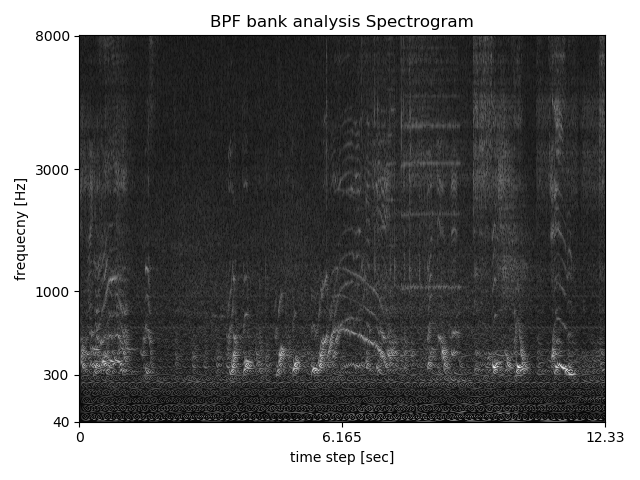

#  multiple sound sources spectrogram   
    
This is an example of multiple sound sources spectrogram and clarity deteriorated one via sound path.  
   
[github repository](https://github.com/shun60s/spectrogram2/)  
  

## description  

Following figure is BPF bank analysis spectrogram of ball game narration that consists of a few speakers and  effected sound. (wav/original_sound.wav)  

  

And next figure is clarity deteriorated one via sound path, from loudspeaker to microphone. (wav/mic_record.wav)   
Some part of harmonic structure of each source is lost to compare with original sound.  

  

